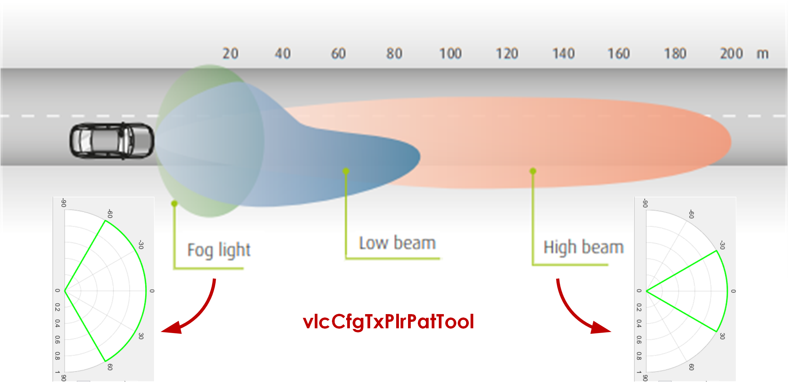
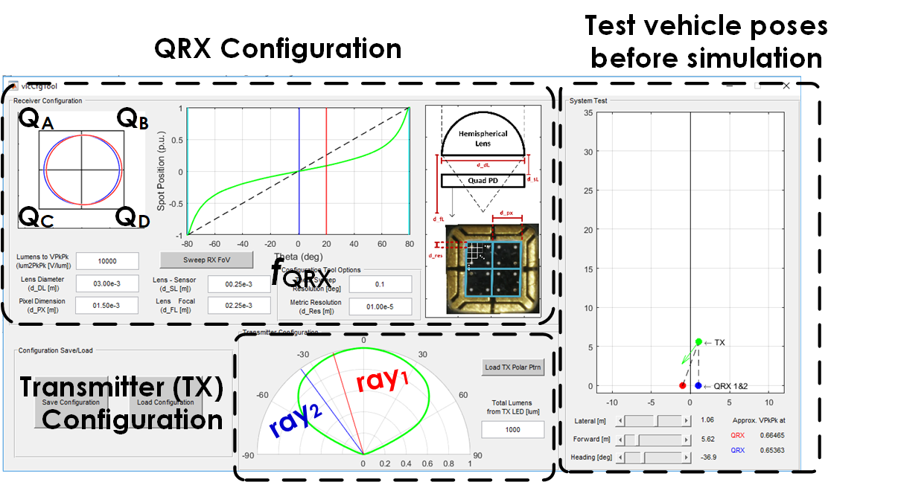

## VLC Configuration Tool

Two main components:

1) <ins>"vlcCfgTxPlrPatTool/vlcCfgTxPlrPatTool.m"</ins> : Create custom polar intensity patterns for custom LED lights, e.g., a high beam vs. a fog light

Image source: Valeo, "Lighting Systems, From light to advanced vision technologies", _ValeoScope_ , 06.2015. [Link accessed on 05.05.2020](https://www.dalroad.com/wp-content/uploads/2015/06/lighting_systems_from_light_to_advanced_vision_technologies_technical_handbook_valeoscope_en_998542_web.pdf)

This tool produces a "vlcCfgTxPlrPatTool/data/vlcCfgTxPlrPat_<>.mat" file which is used by the vlcCfgTool.m for transmitter configuration.

2) <ins>"vlcCfgTool.m/fig"</ins> : Configure the VLC transmitter and receiver and load/save the configuration to a "data/vlcCfg_<>.mat" file for later use by "../02_v2lcDataGen". This is a MATLAB© GUI which utilizes auxiliary functions from "fcn/", so run the vlcCfgTool.m file, it will trigger the vlcCfgTool.fig file and start the GUI:

The transmitter polar pattern should be a "vlcCfgTxPlrPatTool/data/vlcCfgTxPlrPat_<>.mat" file; the Total Lumens from TX LED scales the normalized polar pattern to full intensity.

The novel receiver architecture, named QRX, consists of a quadrant-photodiode and a hemispherical lens. The QRX configuration parameters determine a certain mapping from the Spot Position (determines power on each quadrant) to theta, which is the angle-of-arrival; this mapping is plotted on the GUI. The mapping, which is calculated by ray optics relations, is re-simulated every time a parameter changes; to speed up this update, the Theta Sweep Resolution and Metric Resolution under "Configuration Tool Options" can be reduced. The mapping is related to f_{QRX} in the submitted article, the inverse of which is used for estimating angle-of-arrival.

For the given transmitter and receiver configurations, the tool also provides the "System Test" functionality on the right, which allows for testing how much power will be received by each ego vehicle QRX facing the target vehicle  for a given relative pose of the target vehicle: Adjust Lateral, Forward and Heading and observe the red and blue QRX VPkPk markings on the bottom right.
