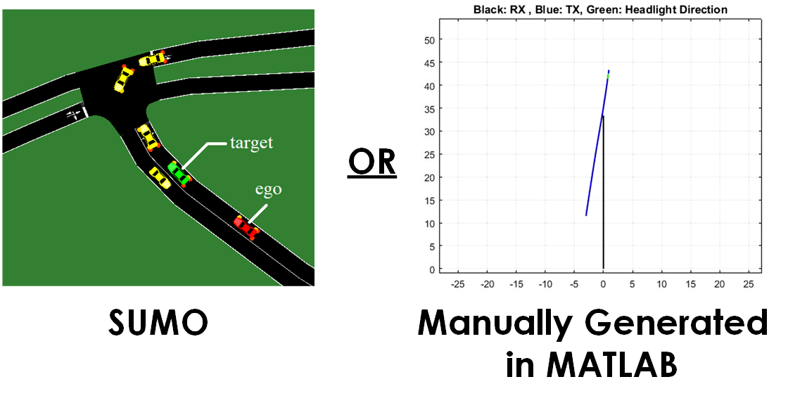

## Vehicle Trajectory Configuration Tool

Two options here: 

1) <ins>"vehCfgSumoTool.m"</ins> : Use [SUMO](https://sumo.dlr.de/docs/index.html) generated trajectories. A SUMO simulation generated with the SUMO OSM Web Wizard that utilizes ["Floating Car Data" (FCD)](https://sumo.dlr.de/docs/Simulation/Output/FCDOutput.html) can generate CSV files containing the trajectory information for each vehicle in the simulation. With a few tweaks (which are manual for now, will be automated later on, further explanations in "sumo_ws/readme.md") these CSV files can provide trajectory information for our simulator. This script ingests the CSV files and generates trajectories that can be used in "../02_v2lcDataGen". 

2) <ins>"vehCfgManualTool.m"</ins> : Manually generate trajectories that can be used in "../02_v2lcDataGen". This script takes waypoints on a trajectory as inputs and interpolates between the waypoints with resolution depending on sampling constraints. There are two sampling periods in our simulator: vehicle simulation sampling period and VLC simulation sampling period. The sampling period here denotes the vehicle simulation sampling period. 

The trajectories generated by these two tools are equivalent and both can be used in "../02_v2lcDataGen".

 