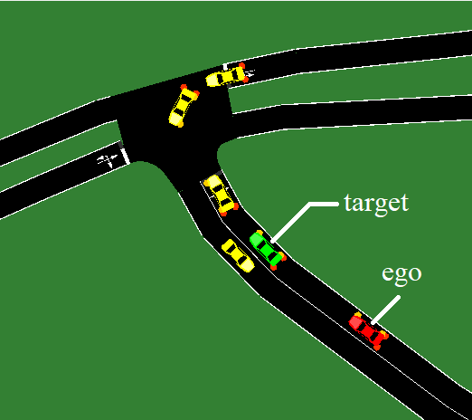

"sumo_kocbalik" is an example SUMO simulation folder. It was manually edited after being generated from the OSM Web Wizard to obtain [FCD](https://sumo.dlr.de/docs/Simulation/Output/FCDOutput.html) CSV files for veh8, veh12, veh13. Preferably, copy this folder and change the contents with respect to your own SUMO simulation folder for an easier migration proces. More rigorous documentation and hopefully an automatizaion of the SUMO-to-v2lc_sim process will follow here...

The simulation considers an intersection next to a restaurant near Koc University, Istanbul, Turkey; the intersection is notorious for traffic accidents

 
