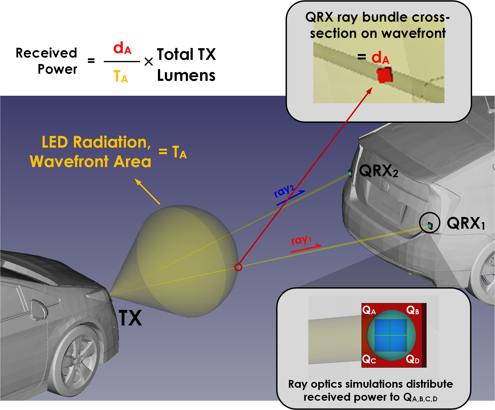

## Vehicular VLC Simulation

<ins>"v2lcDataGen.m"</ins>: The simulator utilizes ego and target vehicle trajectories that are either manually generated, or generated from the well-known microscopic traffic simulator [SUMO](https://sumo.dlr.de/docs/index.html), and generates the signals that emanate from the two target TXs and reach the two ego QRXs, for the whole trajectory. VLC channel simulation is radiometric, i.e., calculates what portion of the power leaving the TX reaches the QRX. A VLC configuration from "00_vlcCfg/data" and a trajectory from "01_vehCfg/data" is used and a simulation run output is generated as a "02_v2lcDataGen/data/v2lcRun_<>.mat" file. The angle-of-arrival on the QRXs are calculated and are used for localization and pose estimation. 

A representative image of the simulator is shown below (there's no 3D rendering involved, this is just to demonstrate the concept). The received power equation corresponds to a uniform beam pattern in this diagram for simple demonstration. Non-uniform beam patterns, as in the simulations provided in the article with the "default" VLC configuration which includes a typical tail-light, are also supported; non-uniform beam patterns scale the wavefront distribution according to the polar intensity distribution of the source, which is provided/adjusted by tools in "00_vlcCfg".

 Car 3D model from [link, accessed on 05.05.2020](https://www.cgtrader.com/items/153014/download-page#)
