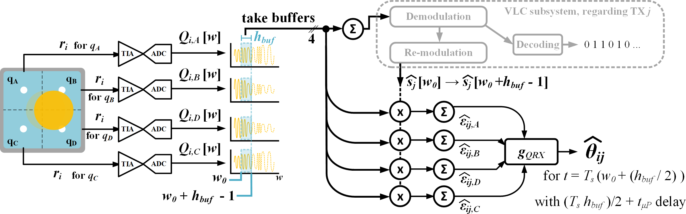
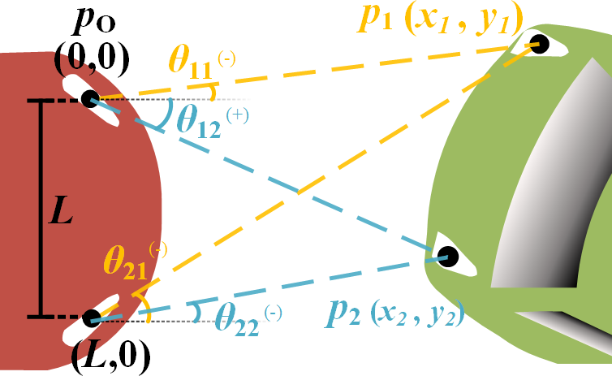

## Simulation scenarios

One script for each scenario in the manuscript. The flags "sim" and "res" control whether to simulate and/or see the results. See the manuscript and the comments for further details about the scenarios.

### AoA measurement procedure

AoA measurement with the novel QRX

### Vehicle localization with AoA-based VLP

This is basically triangulation, but the geometry is based on QRX usage.

