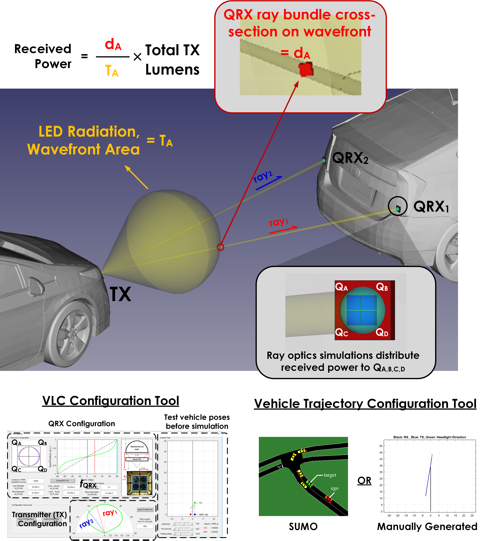

# Vehicular VLC Simulator

A MATLAB©-based vehicular visible light communication (VLC) simulator for the following article in review:

B. Soner, S. Coleri, "Visible Light Communication based Vehicle Localization and Pose Estimation".

VLC channel simulation assumes LoS trajectories between transmitter and receiver, and is radiometric, i.e., calculates what portion of the power leaving the transmitter reaches the receiver. 
Transmitters are LED head/tail lights and a custom angle-of-arrival-sensing VLC receiver, QRX, is utilized. The AoA on the QRXs are calculated and are used for localization and pose estimation.
Vehicle trajectories are either generated using the well-known microscopic traffic simulator SUMO or generated manually using a custom MATLAB© script.

The main components of the simulator are given below. Each component is configurable, and is documented in place.

- VLC Transmitter and Receiver Configuration Tool (00_vlcCfg)

- VLC Transmitter Radiation Pattern Configuration Tool (00_vlcCfg/vlcCfgTxPlrPatTool)

- Vehicle Trajectory Configuration Tool (01_vehCfg)

- Vehicular VLC Simulation (02_v2lcDataGen)

- Localization and Pose Estimation Algorithm (03_vlpAlgoSim)

An overview of the simulator is shown below:

Car 3D model from: https://www.cgtrader.com/items/153014/download-page#
