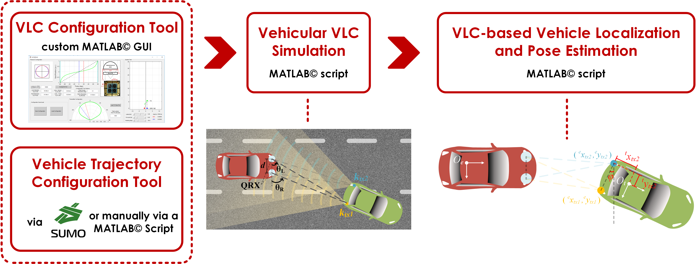

# Vehicular VLC-VLP-VPE Simulator

A MATLAB©-based vehicular visible light communication (VLC) simulator for vehicle localization via visible light positioning (VLP) and VLP-based pose estimation (VPE). The simulator supports the following article under review:

B. Soner, S. Coleri, "Visible Light Communication based Vehicle Localization and Pose Estimation".

## Overview

VLC channel simulation is radiometric and assumes LoS communication. VLC units are vehicle head/tail lights consisting of LED lights as transmitters and custom angle-of-arrival-sensing receivers, named QRX. The angle-of-arrival on the QRXs are calculated and are used for localization and pose estimation. Vehicle trajectories are either generated using the well-known microscopic traffic simulator SUMO or generated manually using a custom MATLAB© script.

The main components are given below. Each component is configured via a script or a GUI, and is documented in place.

- **VLC Configuration Tool ([00_vlcCfg](https://github.com/sonebu/v2lc_sim/tree/master/00_vlcCfg))** (QRX is the novel receiver proposed in the article)

- VLC Transmitter Radiation Pattern Configuration Tool ([00_vlcCfg/vlcCfgTxPlrPatTool](https://github.com/sonebu/v2lc_sim/tree/master/00_vlcCfg/vlcCfgTxPlrPatTool))

- Vehicle Trajectory Configuration Tool ([01_vehCfg](https://github.com/sonebu/v2lc_sim/tree/master/01_vehCfg))

- Vehicular VLC Simulation ([02_v2lcDataGen](https://github.com/sonebu/v2lc_sim/tree/master/02_v2lcDataGen))

- **Localization and Pose Estimation Algorithm ([03_vlpAlgoSim](https://github.com/sonebu/v2lc_sim/tree/master/03_vlpAlgoSim))** (the novel algorithm proposed in the article)

## How to use the simulator

- To regenerate the simulation figures in the article: run "03_vlpAlgoSim/vlpAlgoSim_plotResults.m" and choose which simulation you want to re-run. These correspond to the simulation scenarios presented in the article. You can't generate/plot new scenarios with this.

- To re-run the algorithm with pre-computed example simulation data: Change the "Algorithm Parameters" block in "03_vlpAlgoSim/vlpAlgoSim_2qrx.m" as necessary (e.g., to choose a different VLC noise level, to change estimation rate etc.), run the script, and choose which simulation data you want to re-run the algorithm for.

- To re-generate simulation data for an example trajectory and an example VLC configuration: run "02_v2lcDataGen/v2lcDataGen.m" and choose 1-which VLC config you want, 2-which trajectory you want. Each trajectory corresponds to a simulation scenario in the article but the default VLC configuration (corresponding to a typical vehicle tail-light) is used for all scenarios.

- To edit the VLC or vehicle trajectory configurations and re-run the whole simulation process from scratch: follow the guidelines under each folder. 
