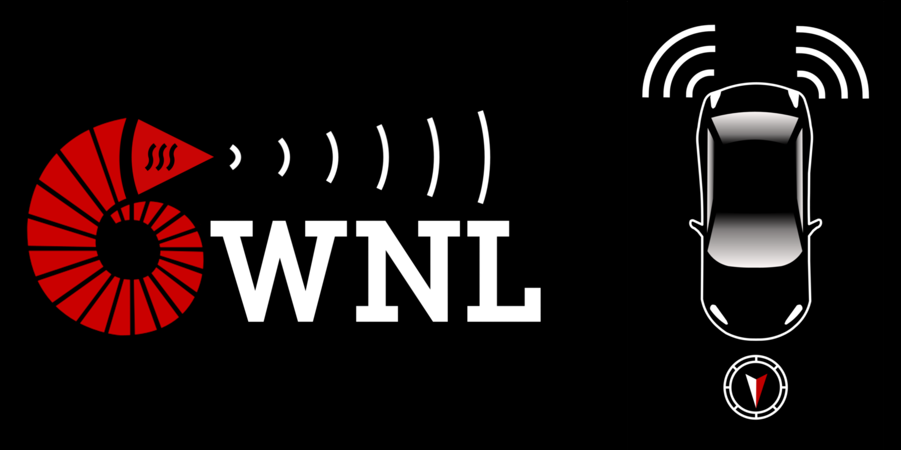
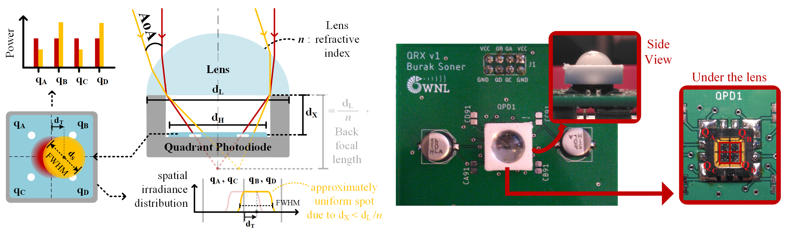
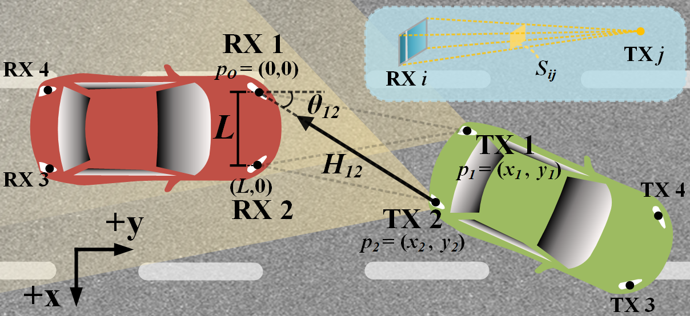

# VLC-based Vehicle Localization Simulator

   
A MATLAB©-based vehicular visible light communication (VLC) simulator for vehicle localization via visible light positioning (VLP). The simulator supports the following article under review:

B. Soner, S. Coleri, "Visible Light Communication based Vehicle Localization for Collision Avoidance and Platooning".

## Overview

VLC channel simulation is radiometric and assumes LoS communication. VLC units are vehicle head/tail lights consisting of LED lights as transmitters and custom angle-of-arrival-sensing receivers, named QRX. The angle-of-arrival on the QRXs are calculated and are used for localization and pose estimation. Vehicle trajectories are either generated using the well-known microscopic traffic simulator [SUMO](https://sumo.dlr.de/docs/index.html) or generated manually using a custom MATLAB© script.

The main components are given below. Each component is configured via a script, and is documented in place.

- **VLC Configuration Tool ([00_vlcCfg](https://github.com/sonebu/v2lc_sim/tree/master/00_vlcCfg))** (QRX is the novel receiver proposed in the article, the schematics for the prototype will be provided in the future)

- Vehicle Trajectory Configuration Tool ([01_vehCfg](https://github.com/sonebu/v2lc_sim/tree/master/01_vehCfg))

- Vehicular VLC Simulation ([02_v2lcDataGen](https://github.com/sonebu/v2lc_sim/tree/master/02_v2lcDataGen))

- **Simulations for the Localization Algorithm ([03_simulations](https://github.com/sonebu/v2lc_sim/tree/master/03_simulations))** (the novel algorithm proposed in the article)

**QRX:** 
   

**System Model:**
   

## How to use the simulator

- To regenerate the simulation figures in the article: run the corresponding .m file under "03_simulations/". These .m files correspond to the simulation scenarios presented in the article. Check the "sim" and "res" flags inside: Sim re-generates algorithm simulation results, res just prints results with previously generated simulation results.

- To re-generate simulation data for an example trajectory and an example VLC configuration: run "02_v2lcDataGen/v2lcDataGen.m" and choose 1-which VLC config you want, 2-which trajectory you want. Each trajectory corresponds to a simulation scenario in the article but the default VLC configuration (corresponding to a typical vehicle tail-light) is used for all scenarios.

- To edit the VLC or vehicle trajectory configurations and re-run the whole simulation process from scratch: follow the guidelines under each folder. 
